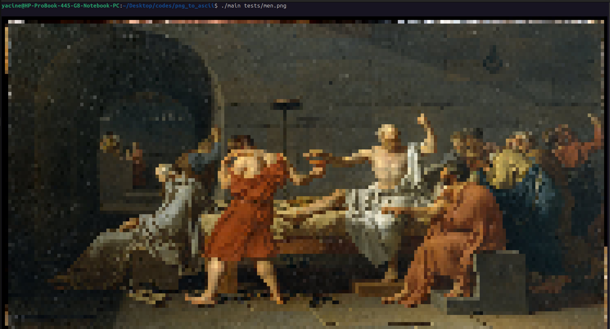

# Ascii.png

A from-scratch PNG/JPG decoder and terminal renderer written in C.

Parses PNG/JPG chunks/markers manually, decompresses data (zlib for PNG, Huffman decoding for JPG), applies all required transformations, then renders the result to your terminal using Unicode half-block characters with 24-bit true color ANSI escapes.



## Features

**PNG Support:**
- Manual PNG chunk parsing (IHDR, IDAT, IEND)
- Full filter reconstruction (None, Sub, Up, Average, Paeth)
- zlib decompression of IDAT data

**JPG Support:**
- Manual JPG marker parsing (SOF, DQT, DHT, SOS, EOI)
- Huffman decoding (DC and AC coefficients)
- Dequantization and IDCT (8x8 blocks)
- YCbCr to RGB color conversion
- Chroma subsampling (4:2:0, 4:2:2, 4:4:4)

**Both Formats:**
- True color output (16 million colors)
- Half-block rendering for 2x vertical pixel density
- Auto-scales to terminal size via ioctl
- Automatic format detection (PNG vs JPG)
- Verbose debugging mode
- Saves output to a ppm file 

## Build

```bash
$ gcc -o image_viewer src/jpg.c src/png.c main.c -lm -lz -Iinclude
```

## Usage

```bash
$ ./image_viewer <image_path:Required> <verbose:Optional> <output_file_name:Optional>
```

